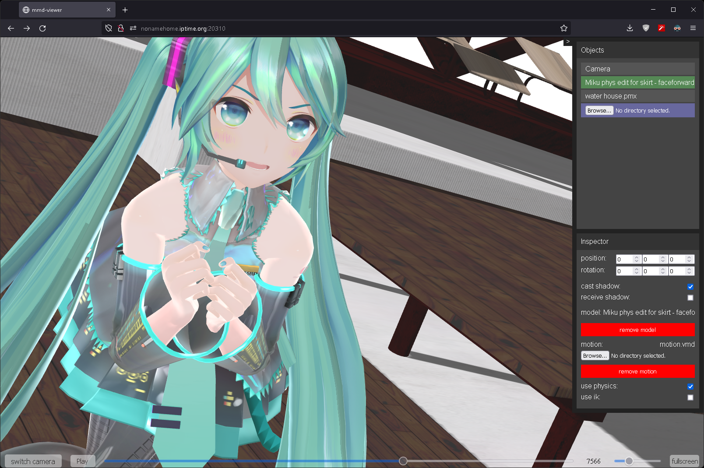
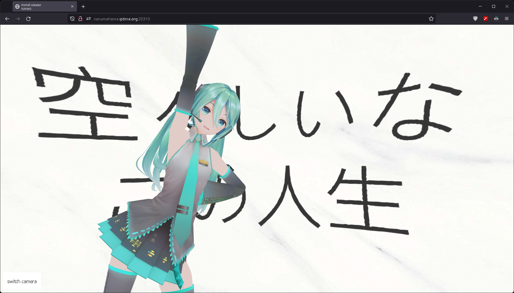
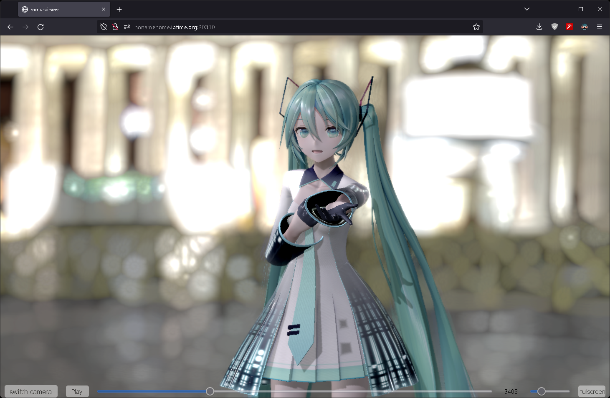

# web-mmd-viewer

# This project is outdated. Please see [babylon-mmd-viewer](https://github.com/noname0310/babylon-mmd-viewer) which is the more stable and performant.

A sample project using three.js and the-world-engine

Through the-world-engine, you can build a scene of three.js in a declarative form.

Scripting is also possible through a the-world-engine messaging system - similar to the Unity

As a result, it becomes very intuitive to build a scene of three.js.

```typescript
// src/asset/Bootstrapper.ts

export class Bootstrapper extends BaseBootstrapper {
    public override run(): SceneBuilder {
        //...
        
        return this.sceneBuilder
            //...

            .withChild(instantiater.buildGameObject("orbit-camera", new THREE.Vector3(0, 0, 40))
                .withComponent(Camera, c => {
                    c.cameraType = CameraType.Perspective;
                    c.fov = 60;
                    c.far = 1500;
                    c.priority = -1;
                })
                .withComponent(OrbitControls, c => {
                    c.enabled = true;
                    c.target = new THREE.Vector3(0, 14, 0);
                    c.minDistance = 20;
                    c.maxDistance = 100;
                    c.enableDamping = false;
                })
                .getComponent(Camera, orbitCamera))
            
            .withChild(instantiater.buildGameObject("ambient-light")
                .withComponent(Object3DContainer, c => c.object3D = new THREE.HemisphereLight(0xffffff, 0xffffff, 0.3)))

            .withChild(instantiater.buildGameObject("directional-light", new THREE.Vector3(-20, 30, 100))
                .withComponent(Object3DContainer, c => {
                    const light = new THREE.DirectionalLight(0xffffff, 0.5);
                    //...
                    c.object3D = light;
                })
                .getComponent(Object3DContainer, directionalLight))

            .withChild(instantiater.buildGameObject("polar-grid-helper")
                .active(false)
                .withComponent(Object3DContainer, c => c.object3D = new THREE.GridHelper(30, 10)))
        
            //...

            .withChild(instantiater.buildGameObject("mmd-model")
                .withComponent(Object3DContainer, c => {
                    c.startCoroutine(loadAndRun());

                    function *loadAndRun(): CoroutineIterator {
                        //...
                        const loader = new MMDLoader();

                        let model: THREE.SkinnedMesh<THREE.BufferGeometry, THREE.Material | THREE.Material[]>|null = null;
                        loader.load(modelFile, object => model = object, makeProgressUpdate("model", modelLoadingText));
                        yield new WaitUntil(() => model !== null);
                        modelLoadingText.innerText = "model loaded";

                        c.object3D = model;

                        const threeCamera = DuckThreeCamera.createInterface(camera.ref!, false).toThreeCamera();
                        
                        let modelAnimation: THREE.AnimationClip|null = null;
                        loader.loadAnimation(vmdFiles as any, model!,
                            object => modelAnimation = object as THREE.AnimationClip, makeProgressUpdate("model animation", modelAnimationLoadingText));
                        yield new WaitUntil(() => modelAnimation !== null);
                        modelAnimationLoadingText.innerText = "model animation loaded";

                        let cameraAnimation: THREE.AnimationClip|null = null;
                        loader.loadAnimation(cameraFile, threeCamera,
                            object => cameraAnimation = object as THREE.AnimationClip, makeProgressUpdate("camera motion", cameraLoadingText));
                        yield new WaitUntil(() => cameraAnimation !== null);
                        cameraLoadingText.innerText = "camera loaded";
                        
                        const helper = new MMDAnimationHelper()
                            .enable("physics", vmdFiles.length < 2)
                            .enable("cameraAnimation", true)
                            .add(model!, { animation: modelAnimation! })
                            .add(threeCamera, { animation: cameraAnimation! });

                        loadingText.remove();
                        yield null;
                        for (; ;) {
                            helper.update(c.engine.time.deltaTime);
                            c.updateWorldMatrix();
                            yield null;
                        }
                    }
                }))
        ;
    }
}
```
## Preview

### [viewer build](https://noname0310.github.io/web-mmd-viewer/viewer)



credit:

- model: YYB/HB-Squiddy/FreezyChan-3Dreams
  https://www.deviantart.com/hb-squiddy/art/MMD-YYB-Miku-Default-edit-v1-4-4-DL-844198863
- motion: imarine-project
  https://imarine-project.jp/#op1
- camera: nyanposu
  https://bowlroll.net/file/265140
- stage: つくあん
  https://bowlroll.net/file/230141



credit:

- model: YYB / とぁさん (The download seems to have disappeared)
- motion: 卜逻desu
- background: 卜逻desu
https://www.bilibili.com/video/BV1r7411u7ST?spm_id_from=333.337.search-card.all.click&vd_source=b0c43e82eef9e53703c8aff044b7a6f6

## MMD Demo: Melancholy Night

### [demo build](https://noname0310.github.io/web-mmd-viewer/melancholic_night)



credit:

- model: YYB
  https://www.deviantart.com/sanmuyyb/art/YYB-Hatsune-Miku-10th-DL-702119716
- motion: ほうき堂
- camera: ほうき堂
  https://www.nicovideo.jp/watch/sm41164308
- background: Andreas Mischok
  https://polyhaven.com/a/st_peters_square_night
